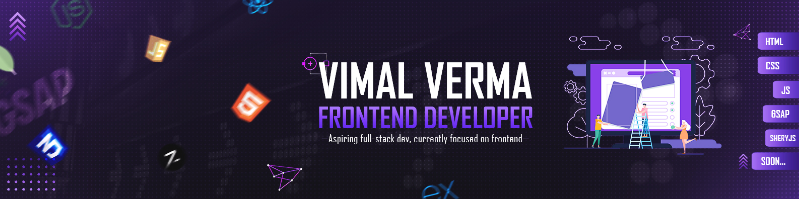

<h1 align="center">Hi 👋, I'm Vimal</h1>
<h3 align="center">Frontend Developer | Future Full-Stack & DevOps Engineer 🚀</h3>

  
   

## 👨‍💻 About Me

- 🔭 I’m currently working on **Frontend projects using HTML, CSS, JS, GSAP, Lenis, and SheryJS**
- 🌱 I’m currently learning **React.js** → soon moving to **Next.js** → **MERN Stack** → **DevOps**
- 👯 I’m looking to collaborate on **creative frontend websites & animation-rich web experiences**
- ⚡ Fun fact: I love smooth animations, pixel art, and gaming interfaces!
- 🎯 Long-term Goal: Become a **Software Engineer** with skills in **DevOps, Docker**

<h2>🚀 Tech & Tools Preference</h2>

# 📊 GitHub Stats:

