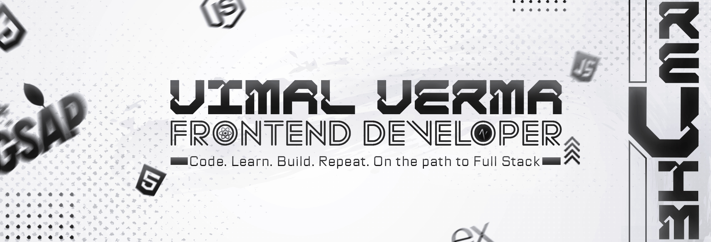

<!-- Banner -->

  

<!-- Typing header -->
<h1 align="center">
  
</h1>

<h2 align="center">Frontend Developer 🎨 | Future Full-Stack & DevOps Engineer</h2>

<!-- Socials -->

  
  
  

# 👨‍💻 About Me  

- 🎯 Building **Frontend Projects** with `HTML`, `CSS`, `JavaScript`, `GSAP`
- 🌱 Currently learning `React.js`, will move to `Next.js` → `MERN Stack` → `DevOps`
- 🤝 Open to collaborating on **creative frontend websites**
- 🧠 Long-Term Goal: Become a **Software Engineer** skilled in `DevOps`, `Docker`

<h1>🚀 Tech stack & Tools</h1>

  
  
  
  
  
  
  
  
  
  
  
  
  
    

  
My Tech Stack

  ### 🖥️ Languages
  - HTML, CSS, JavaScript

  ### ⚛️ Frameworks & Libraries
  - Tailwind CSS
  - GSAP, Lenis

  ### 🛠️ Tools
  - Git & GitHub
  - VS Code
  - Figma, Photoshop
  - Vercel, Vite, NPM

## 📈 GitHub Stats

<table>
  <tr>
    <td>
      
    </td>
    <td>
      
    </td>
  </tr>
</table>

## ✨ Currently Learning

- React.js (practicing projects)
- Framer Motion (for animation)
- Building cleaner UI & animation-rich experiences

## 🛠️ Future Goals
- Learn `Next.js` and complete the **MERN Stack**
- Dive into `TypeScript` and `Framer Motion`
- Explore `DevOps`, `Docker`, and deployment workflows for scalable apps

## 🌐 Connect With Me

  
  
  

